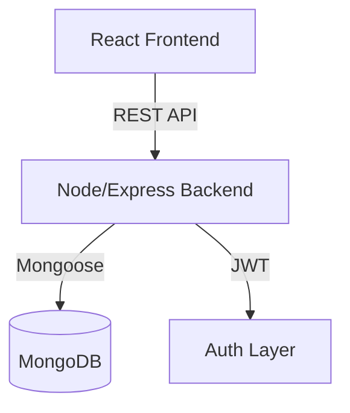

# Project Documentation: Task Manager Application

**Prepared by:** Tejas Ambaliya  
**Date:** March 2026

---

## 1. Introduction
The Task Manager Application is a full-stack web platform designed to streamline personal and organizational productivity. In an era of digital transformation, efficient task tracking is essential. this application provides a robust suite of tools for users to organize their daily activities while offering administrative oversight for system-wide management.

## 2. Project Objectives
- **Centralized Task Tracking**: Provide a single repository for all user tasks.
- **Enhanced Security**: Implement industry-standard authentication and authorization.
- **Administrative Transparency**: Allow administrators to monitor system usage and task distribution.
- **Scalable Architecture**: Ensure the application can grow with increasing user demand.
- **User Experience**: Deliver a clean, intuitive, and responsive interface.

## 3. System Architecture
The application follows a **Client-Server Architecture** with a clear separation of concerns:
- **Presentation Layer (Frontend)**: A Single Page Application (SPA) built with React.
- **Application Layer (Backend)**: A RESTful API built with Node.js and Express.js.
- **Data Layer (Database)**: A document-oriented NoSQL database (MongoDB) for persistent storage.

## 4. Technology Stack Explanation
- **Frontend**: React's component-based architecture ensures reusability and maintainability. Redux Toolkit provides a predictable state container for complex application logic.
- **Backend**: Node.js and Express offer a fast and scalable environment for JavaScript-based server development.
- **Database**: MongoDB's JSON-like documents align perfectly with the application's data structures, allowing for rapid iteration.
- **Security**: JWT (JSON Web Tokens) enables stateless authentication, while bcrypt ensures passwords are never stored in plain text.

## 5. Database Design
The system utilizes two primary collections in MongoDB:

### User Collection
| Field | Type | Description |
|---|---|---|
| `_id` | ObjectId | Unique identifier |
| `name` | String | User's full name |
| `email` | String | Unique login email |
| `password` | String | Hashed password |
| `role` | String | 'user' or 'admin' |
| `createdAt` | Date | Registration timestamp |

### Task Collection
| Field | Type | Description |
|---|---|---|
| `_id` | ObjectId | Unique identifier |
| `user` | ObjectId | Reference to the owner (User) |
| `title` | String | Task summary |
| `description` | String | Detailed task notes |
| `completed` | Boolean | Task status flag |
| `createdAt` | Date | Creation timestamp |

## 6. API Design
The RESTful API provides the following endpoints:

| Method | Endpoint | Description | Auth Required |
|---|---|---|---|
| POST | `/api/register` | User registration | No |
| POST | `/api/login` | User login | No |
| GET | `/api/tasks` | Retrieve user tasks | Yes |
| POST | `/api/tasks` | Create new task | Yes |
| PUT | `/api/tasks/:id` | Update task | Yes |
| DELETE | `/api/tasks/:id`| Remove task | Yes |
| GET | `/api/admin/users-tasks` | System-wide overview | Yes (Admin) |

## 7. Frontend Structure
The React frontend is organized into logical components:
- **Components**: Reusable UI elements (`Login`, `Register`, `Task`, `Navbar`).
- **Redux**: Contains `componentSlice.js` for managing active views and application state.
- **Tests**: Houses component and integration tests.

## 8. Authentication Flow
1. User provides email and password.
2. Server validates credentials against the database.
3. Upon success, a JWT is generated and sent back (optionally via HTTP-only cookie).
4. Client stores user info and includes credentials in subsequent API requests.
5. Protected routes on the client-side verify the user's role and authentication status.

## 9. Task Management Flow
1. **Creation**: User submits the task form; data is sent to `POST /api/tasks`.
2. **Retrieval**: The `Task` component triggers a fetch from `GET /api/tasks` on mount.
3. **Modification**: Users can edit or toggle the completion status of their tasks.
4. **Deletion**: Users can permanently remove tasks from their dashboard.

## 10. Testing Strategy
Our testing approach ensures reliability at multiple levels:
- **Component Testing**: Verifying that `Login` and `Register` pages render correctly and handle user input.
- **API Integration Testing**: Using Jest and Axios to simulate real-world API requests, ensuring the backend responds correctly to valid and invalid credentials.
- **Test Environment**: Environment variables are used to isolate testing data from production data.

## 11. Security Considerations
- **Password Hashing**: Using `bcrypt` with a salt factor of 10.
- **JWT Security**: Tokens are signed with a strong secret key.
- **CORS Protection**: Access is restricted to the authorized client URL.
- **Input Validation**: Server-side checks ensure required data is present and correctly formatted.
- **Environment Isolation**: Sensitive keys are managed via `.env` files.

## 12. Deployment Instructions
1. **Environment Config**: Set all production environment variables.
2. **Database Migration**: Ensure the target MongoDB instance is accessible.
3. **Build Frontend**: Execute `npm run build` in the client directory.
4. **Process Management**: Use a process manager like **PM2** to run the Node.js server.
5. **SSL/TLS**: Deploy behind a reverse proxy (like Nginx) with HTTPS enabled.

## 13. Future Improvements
- **Password Reset**: Implement an email-based recovery system.
- **Task Categories**: Allow users to group tasks by project or priority.
- **Notifications**: Real-time alerts for impending deadlines.
- **Social Login**: Integration with OAuth providers (Google, GitHub).

## 14. Conclusion
The Task Manager Application demonstrates a modern, secure, and featured-packed solution for task management. By leveraging the MERN stack and industry-standard security practices, the project provides a solid foundation for both personal productivity and administrative oversight.
